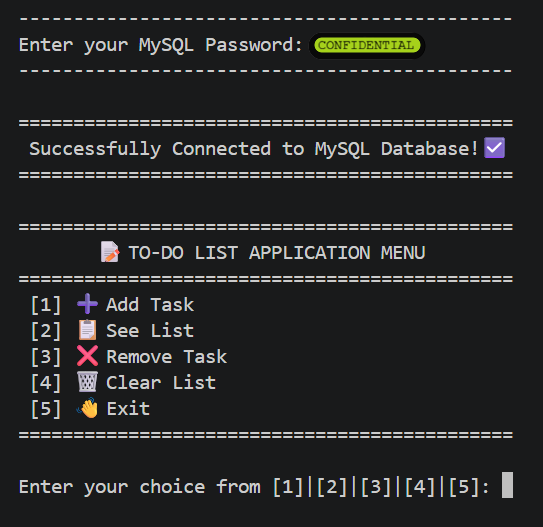
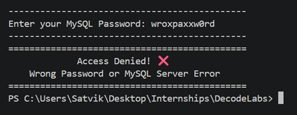
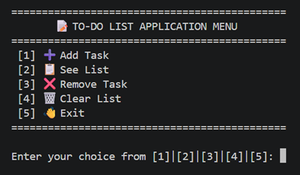
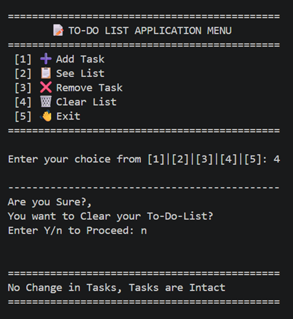
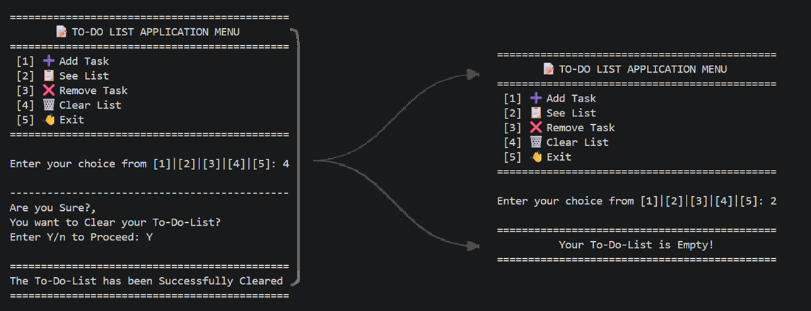
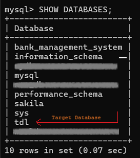
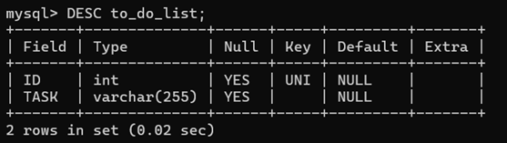
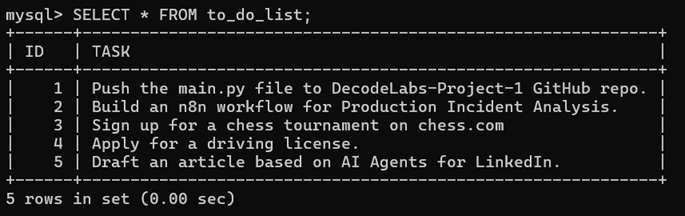

# 📝 DecodeLabs Project 1 - Python To-Do List Application

<p align="center">


</p>

---

## 📌 About The Project

This project was developed as a part of the **DecodeLabs Industrial Training Program (Batch 2026)**.

The objective of this project was to build a command-line **To-Do List Application** using Python. Instead of stopping at the basic project requirements, I decided to extend it further by integrating **MySQL** so that tasks remain permanently stored even after the application is closed.

The application supports complete CRUD operations, automatic database creation, persistent storage, task management, and a clean command-line interface.

---

# 🎥 Project Demonstration

A complete walkthrough of the application can be viewed here:

▶️ **[Watch / Download the Demo Video](assets/demo.mp4)**


---

# 📷 Project Screenshots

## Authentication

| Successful Connection | Wrong Password |
|-----------------------|----------------|
|  |  |

---

## Application Menu



---

## Adding a Task


---

## Viewing Tasks


---

## Removing a Task


---

## Clearing the To-Do List

| Cancel Clear | Empty List |
|--------------|------------|
|  |  |

---

## MySQL Database

| Database | Structure |
|----------|-----------|
|  |  |

### Stored Records



---

# ✨ Features

- Secure MySQL Password Input
- Automatic Database Creation
- Automatic Table Creation
- Persistent Task Storage
- Add New Tasks
- View Tasks
- Remove Existing Tasks
- Clear Entire To-Do List
- Automatic ID Management
- Stored Procedure for ID Renumbering
- Exception Handling
- Keyboard Interrupt Handling
- Text Wrapping for Long Tasks
- User-Friendly Command Line Interface

---

# 🛠 Tech Stack

- Python 3
- MySQL
- MySQL Connector/Python
- SQL
- Command Line Interface (CLI)

---

# 📂 Project Structure

```text
DecodeLabs-Project-1/
│
├── assets/
│   └── demo.mp4
│
├── database/
│   ├── sample_to_do_list.csv
│   └── sql_commands_used.sql
│
├── docs/
│   └── DecodeLabs_Project_1_Guidelines.pdf
│
├── screenshots/
│   ├── authentication/
│   ├── application_menu/
│   ├── add_task/
│   ├── remove_task/
│   ├── clear_tasks/
│   ├── mysql/
│   ├── code_snippets/
│   ├── exit_application/
│   └── view_task/
│
├── main.py
├── README.md
└── requirements.txt
```

---

# ⚙ Installation

Clone the repository

```bash
git clone https://github.com/Satvik-Creations/DecodeLabs-Project-1.git
```

Move into the project

```bash
cd DecodeLabs-Project-1
```

Install dependencies

```bash
pip install -r requirements.txt
```

Run the project

```bash
python main.py
```

---

# 🗄 Database

The application automatically performs the following operations during its first execution.

- Creates the database `TDL`
- Creates the table `to_do_list`
- Retrieves existing tasks
- Saves newly added tasks
- Updates task IDs after deletion

No manual database setup is required.

---

# 📄 SQL Commands Used

The project makes use of SQL operations including

- CREATE DATABASE
- CREATE TABLE
- USE
- SELECT
- INSERT
- DELETE
- TRUNCATE
- CALL
- DROP PROCEDURE
- CREATE PROCEDURE

A complete reference is available inside

```text
database/sql_commands_used.sql
```

---

# 📚 Concepts Covered

- Python Functions
- Lists
- Dictionaries
- Exception Handling
- File Structure
- MySQL Connectivity
- CRUD Operations
- SQL Stored Procedures
- Data Persistence
- Command Line Applications

---

# 🚀 Future Improvements

- Task Priorities
- Due Dates
- Categories
- Search Tasks
- Update Existing Tasks
- Export Tasks to PDF
- GUI Version using Tkinter
- Web Version using Flask

---

# 📖 Internship Information

This project was completed during my Industrial Training at **DecodeLabs** as **Project 1 (Python Programming)**.

Although the original task focused on implementing a To-Do List using Python Lists, I extended the project by integrating **MySQL** to provide persistent storage and demonstrate practical database connectivity.

---

# 👨‍💻 Author

**Satvik Singhal**

B.Tech CSE (AI & ML)

Industrial Training Intern @ DecodeLabs

GitHub: https://github.com/Satvik-Creations

LinkedIn: https://linkedin.com/in/satvik121

---

# ⭐ If you liked this project

If you found this repository useful or interesting, consider giving it a ⭐ on GitHub.

It motivates me to build more projects like this.

---

<p align="center">

Made with ❤️ using Python & MySQL

</p>
